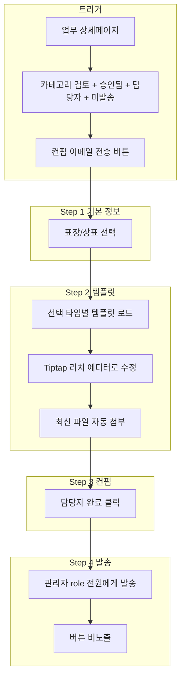

# 컨펌 이메일 전송 기능 - 전체 기획서 (v2)

## 1. 개요

| 항목 | 내용 |
|------|------|
| 기능명 | 컨펌 이메일 전송 |
| 목적 | 검토 카테고리 업무의 담당자가 **역할이 관리자인 모든 사용자**에게 컨펌 확인용 이메일 발송 |
| 트리거 | 업무 상세페이지 `/tasks/:taskId` → '컨펌 이메일 전송' 버튼 클릭 |
| 노출 조건 | `task.task_category === 'REVIEW'` **그리고** `task.task_status === 'APPROVED'` 이고, 해당 업무에 대해 컨펌 이메일 미발송 |
| 사용 권한 | 업무 담당자(assignee)만 버튼 표시 및 사용 |
| 수신 대상 | **하드코딩 금지** — `profiles` 테이블에서 `role = 'admin'` 이고 `is_active = true` 인 모든 사용자의 `email` |

---

## 2. 플로우 다이어그램



---

## 3. 상세 기획

### 3.1 Step 1: 기본 정보 입력

**표장/상표만 선택** — 대표 성함, 대표 이메일 필드 제거

| 필드 | 타입 | 필수 | 설명 |
|------|------|------|------|
| 표장/상표 | 라디오 또는 드롭다운 | O | **표장** 선택 시 표장 템플릿, **상표** 선택 시 상표 템플릿 적용 |

- 선택 시 해당 타입의 DB에 저장된 템플릿을 로드하여 Step 2에 표시
- 사용자 제공 템플릿: `표장_템플릿.docx`, `상표_템플릿.docx` (아래 템플릿 섹션 참조)

---

### 3.2 Step 2: 이메일 템플릿 미리보기 & 편집

- **초안**: Step 1에서 선택한 타입(표장/상표)에 해당하는 템플릿 본문 로드 (치환 변수 없음)
- **에디터**: **Tiptap 리치 에디터** — 굵게, 기울임, 목록 등 포맷팅 지원 (어차피 Tiptap으로 내용 수정)
- **첨부파일**: 해당 업무의 **최신(마지막) 파일** 자동 첨부, **변경 불가** (고정)

**최신 파일 정의**

- `messages` 테이블: `task_id` 일치, `message_type = 'FILE'`, `deleted_at IS NULL`
- `created_at` 기준 내림차순 → 첫 번째 행

**템플릿**: 치환 변수 없음. DB에 저장된 HTML을 그대로 사용하며, Tiptap으로 발송 전 수정 가능.

---

### 3.3 Step 3: 담당자 컨펌

- 작성 완료 후 **[완료]** 버튼 클릭
- **승인 방식**: 담당자 본인이 [완료] 클릭 시 발송 (추가 승인 플로우 없음)

---

### 3.4 Step 4: 발송

- **수신**: `profiles` 테이블에서 `role = 'admin'` 이고 `is_active = true` 인 모든 사용자의 `email`
- **발송 수단**: 새 Edge Function `send-confirm-email`
- **발송 완료 후**: 해당 업무에 대해 '컨펌 이메일 전송' 버튼 비노출

---

## 4. 마이그레이션 파일 구조

**모든 마이그레이션 파일은 `supabase/migrations/email-auto/` 폴더 내에 저장**

```
supabase/migrations/email-auto/
├── 20250304000001_add_confirm_email_sent_at.sql
├── 20250304000002_create_email_template_types.sql
├── 20250304000003_create_email_templates.sql
├── 20250304000004_seed_email_template_types.sql
└── 20250304000005_seed_email_templates.sql
```

---

## 5. 데이터 구조

### 5.1 tasks 테이블 확장

```sql
ALTER TABLE tasks ADD COLUMN IF NOT EXISTS confirm_email_sent_at TIMESTAMPTZ NULL;
```

- 버튼 노출: `task_category = 'REVIEW' AND task_status = 'APPROVED' AND confirm_email_sent_at IS NULL`

### 5.2 email_template_types (표장/상표 타입)

```sql
CREATE TABLE email_template_types (
  id UUID PRIMARY KEY DEFAULT gen_random_uuid(),
  code TEXT UNIQUE NOT NULL,
  label TEXT NOT NULL,
  display_order INT DEFAULT 0
);
```

### 5.3 email_templates (타입별 HTML 템플릿)

```sql
CREATE TABLE email_templates (
  id UUID PRIMARY KEY DEFAULT gen_random_uuid(),
  type_code TEXT NOT NULL REFERENCES email_template_types(code),
  subject_template TEXT,
  body_template TEXT NOT NULL,
  created_at TIMESTAMPTZ DEFAULT now(),
  updated_at TIMESTAMPTZ DEFAULT now()
);
```

### 5.4 수신자 조회 (Edge Function / RPC)

```sql
SELECT id, email, full_name
FROM profiles
WHERE role = 'admin' AND is_active = true AND email IS NOT NULL;
```

---

## 6. 템플릿 관리

### 6.1 사용자 제공 파일

- `표장_템플릿.docx` — 표장 타입 이메일 본문
- `상표_템플릿.docx` — 상표 타입 이메일 본문

### 6.2 템플릿 추출 및 등록

1. **방법 A**: docx를 워드에서 열고 HTML로 저장 후, 시딩 마이그레이션에 포함
2. **방법 B**: [mammoth.js](https://github.com/mwilliamson/mammoth.js) 등으로 docx → HTML 변환 스크립트 실행 후 시딩
3. **방법 C**: 사용자가 docx 내용을 복사해 Admin UI 또는 시딩 SQL에 직접 붙여넣기

**추천**: 구현 시 사용자가 docx 내용을 HTML 형태로 제공하면, 시딩 마이그레이션 `20250304000005_seed_email_templates.sql` 에 INSERT

---

## 7. UI/UX

### 7.1 버튼 배치

- [task-detail-page.tsx](src/pages/task-detail-page.tsx) 헤더 (공유, 상세 정보 버튼 근처)
- 조건: `task.task_category === 'REVIEW'` + `task.task_status === 'APPROVED'` + `!confirm_email_sent_at` + `isAssignee`

### 7.2 플로우 UI

- 다이얼로그/Stepper: Step 1(표장/상표) → Step 2(Tiptap 편집 + 미리보기) → Step 3([완료])

---

## 8. 구현 순서

1. **마이그레이션** — `supabase/migrations/email-auto/` 폴더 생성 및 마이그레이션 작성
   - `confirm_email_sent_at` 추가
   - `email_template_types`, `email_templates` 테이블 생성
   - 시딩: 표장/상표 타입 + 템플릿 (사용자 제공 내용 반영)
2. **Tiptap** — `@tiptap/react`, `@tiptap/starter-kit` 등 패키지 추가
3. **Edge Function** — `send-confirm-email` 구현
   - 수신: `profiles` WHERE `role='admin'` AND `is_active=true` 조회
   - 첨부파일 지원 (업무 최신 파일)
4. **프론트엔드** — `ConfirmEmailDialog` (Step 1 표장/상표, Step 2 Tiptap, Step 3 완료)
5. **연동** — task-detail-page에 버튼 및 다이얼로그
6. **테스트** — 예외 처리, 파일 없음, 관리자 0명 등

---

## 9. 기존 코드 참고

| 용도 | 파일 |
|------|------|
| 업무 상세 페이지 | [src/pages/task-detail-page.tsx](src/pages/task-detail-page.tsx) |
| 메시지(파일) 조회 | [src/api/message.ts](src/api/message.ts) |
| 파일 다운로드 | [src/api/storage.ts](src/api/storage.ts) |
| 이메일 발송 참고 | [supabase/functions/send-task-email/index.ts](supabase/functions/send-task-email/index.ts) |
| profiles role 조회 | [src/api/admin.ts](src/api/admin.ts), `profiles.role`, `profiles.email` |
