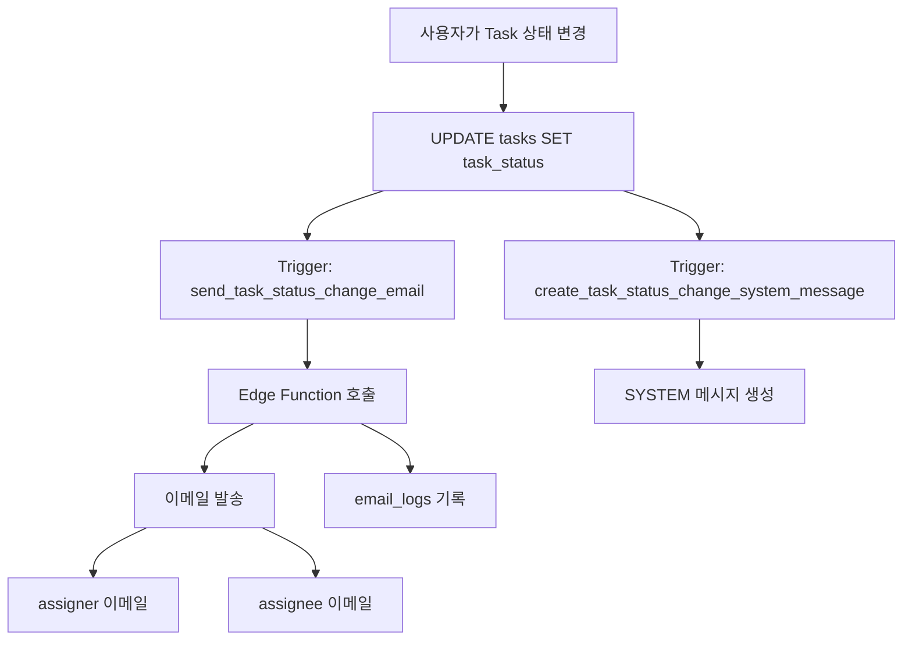
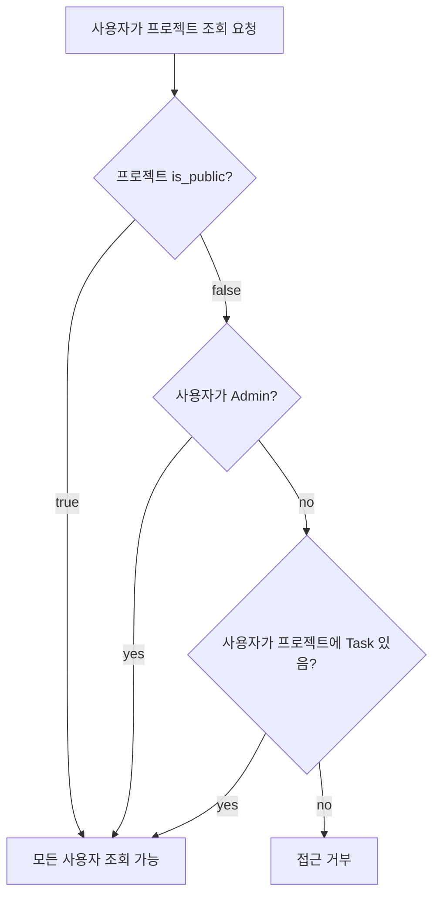

# Tasko 백엔드 아키텍처 문서

## 개요

이 문서는 Tasko 프로젝트의 백엔드 아키텍처와 데이터베이스 스키마를 설명합니다.

## 데이터베이스 스키마

### 테이블 구조

#### 1. projects 테이블
프로젝트 정보를 저장하는 테이블입니다.

| 컬럼 | 타입 | 설명 |
|------|------|------|
| id | UUID | 기본 키 |
| title | TEXT | 프로젝트 제목 |
| client_name | TEXT | 클라이언트명 |
| patent_name | TEXT | 특허명 |
| status | project_status | 프로젝트 상태 (inProgress/done) |
| due_date | TIMESTAMPTZ | 완료 예정일 |
| is_public | BOOLEAN | 공개 여부 (기본값: true) |
| created_by | UUID | 생성자 ID (auth.users 참조) |
| created_at | TIMESTAMPTZ | 생성일시 |
| updated_at | TIMESTAMPTZ | 수정일시 |

**인덱스**:
- `idx_projects_created_by`: created_by
- `idx_projects_status`: status
- `idx_projects_is_public`: is_public
- `idx_projects_due_date`: due_date

#### 2. tasks 테이블
업무(Task) 정보를 저장하는 테이블입니다. 프로젝트의 접근 권한을 상속받습니다.

| 컬럼 | 타입 | 설명 |
|------|------|------|
| id | UUID | 기본 키 |
| project_id | UUID | 프로젝트 ID (projects 참조) |
| title | TEXT | 업무 제목 |
| description | TEXT | 업무 설명 |
| assigner_id | UUID | 할당자 ID (profiles 참조) |
| assignee_id | UUID | 담당자 ID (profiles 참조) |
| task_status | task_status | 업무 상태 (5단계 워크플로우) |
| due_date | TIMESTAMPTZ | 마감일 |
| created_at | TIMESTAMPTZ | 생성일시 |
| updated_at | TIMESTAMPTZ | 수정일시 |

**제약조건**:
- `tasks_assigner_assignee_different`: assigner와 assignee는 달라야 함

**인덱스**:
- `idx_tasks_project_id`: project_id
- `idx_tasks_assigner_id`: assigner_id
- `idx_tasks_assignee_id`: assignee_id
- `idx_tasks_task_status`: task_status
- `idx_tasks_due_date`: due_date
- `idx_tasks_project_status`: (project_id, task_status) 복합 인덱스

#### 3. messages 테이블
채팅 메시지를 저장하는 테이블입니다. USER와 SYSTEM 타입을 지원합니다.

| 컬럼 | 타입 | 설명 |
|------|------|------|
| id | UUID | 기본 키 |
| task_id | UUID | 업무 ID (tasks 참조) |
| user_id | UUID | 사용자 ID (profiles 참조) |
| content | TEXT | 메시지 내용 |
| message_type | message_type | 메시지 타입 (USER/SYSTEM) |
| created_at | TIMESTAMPTZ | 생성일시 |

**인덱스**:
- `idx_messages_task_id`: task_id
- `idx_messages_user_id`: user_id
- `idx_messages_created_at`: created_at (DESC)
- `idx_messages_task_created`: (task_id, created_at DESC) 복합 인덱스
- `idx_messages_message_type`: message_type

#### 4. email_logs 테이블
이메일 발송 로그를 저장하는 테이블입니다.

| 컬럼 | 타입 | 설명 |
|------|------|------|
| id | UUID | 기본 키 |
| task_id | UUID | 업무 ID (tasks 참조) |
| recipient_email | TEXT | 수신자 이메일 |
| recipient_name | TEXT | 수신자 이름 |
| subject | TEXT | 이메일 제목 |
| status | TEXT | 발송 상태 (pending/sent/failed) |
| error_message | TEXT | 에러 메시지 |
| retry_count | INTEGER | 재시도 횟수 |
| created_at | TIMESTAMPTZ | 생성일시 |
| sent_at | TIMESTAMPTZ | 발송 완료일시 |

### ENUM 타입

#### project_status
- `inProgress`: 진행 중
- `done`: 완료

#### task_status
- `ASSIGNED`: 할당됨
- `IN_PROGRESS`: 진행 중
- `WAITING_CONFIRM`: 확인 대기
- `APPROVED`: 승인됨
- `REJECTED`: 거부됨

#### message_type
- `USER`: 사용자 메시지
- `SYSTEM`: 시스템 자동 메시지

## Row Level Security (RLS) 정책

### projects 테이블

1. **SELECT**: 
   - Public 프로젝트: 모든 인증된 사용자 조회 가능
   - Private 프로젝트: Admin 또는 해당 프로젝트에 Task가 있는 사용자만 조회 가능

2. **INSERT**: 인증된 사용자만 생성 가능 (실제로는 Admin만)

3. **UPDATE**: Admin만 수정 가능

4. **DELETE**: Admin만 삭제 가능

### tasks 테이블

1. **SELECT**: 
   - 부모 프로젝트에 접근 권한이 있는 사용자만 조회 가능

2. **INSERT**: 인증된 사용자만 생성 가능 (실제로는 Admin만)

3. **UPDATE**: 
   - **중요**: assigner 또는 assignee만 수정 가능 (Admin은 수정 불가)

4. **DELETE**: Admin만 삭제 가능

### messages 테이블

1. **SELECT**: 부모 Task에 접근 권한이 있는 사용자만 조회 가능

2. **INSERT**: 부모 Task에 접근 권한이 있는 사용자만 생성 가능

3. **UPDATE**: 자신이 작성한 USER 타입 메시지만 수정 가능 (SYSTEM 메시지는 수정 불가)

4. **DELETE**: 자신이 작성한 USER 타입 메시지만 삭제 가능 (SYSTEM 메시지는 삭제 불가)

## Database Triggers

### 1. trigger_send_task_status_change_email

**목적**: Task 상태 변경 시 자동으로 이메일 발송

**트리거 조건**:
- `tasks` 테이블의 `task_status` 컬럼이 변경될 때
- 다음 상태 전환만 트리거:
  - `ASSIGNED` → `IN_PROGRESS`
  - `IN_PROGRESS` → `WAITING_CONFIRM`
  - `WAITING_CONFIRM` → `APPROVED` 또는 `REJECTED`

**동작**:
1. assigner와 assignee의 이메일 주소 조회
2. Edge Function (`send-task-email`) 호출
3. 비동기 HTTP 요청으로 이메일 발송

### 2. trigger_create_task_status_change_system_message

**목적**: Task 상태 변경 시 자동으로 SYSTEM 메시지 생성

**트리거 조건**:
- `tasks` 테이블의 `task_status` 컬럼이 변경될 때

**동작**:
1. 상태 변경 정보를 한국어로 변환
2. `messages` 테이블에 `SYSTEM` 타입 메시지 삽입
3. 메시지 내용: "상태가 [이전상태]에서 [현재상태]로 변경되었습니다. (변경자: 사용자명)"

## Edge Functions

### send-task-email

**경로**: `supabase/functions/send-task-email/index.ts`

**책임**:
- Task 상태 변경 알림 이메일 발송
- Gmail SMTP를 통한 이메일 전송
- 재시도 로직 (최대 3회)
- 이메일 발송 로그 기록

**입력 스키마**:
```typescript
{
  taskId: string;
  oldStatus: string;
  newStatus: string;
  assignerEmail: string;
  assigneeEmail: string;
  changerId: string;
  taskTitle: string;
  projectTitle: string;
}
```

**출력 스키마**:
```typescript
{
  success: boolean;
  message: string;
  results: Array<{
    success: boolean;
    recipient: string;
    error?: string;
  }>;
}
```

**환경 변수** (Supabase Secrets):
- `SMTP_USER`: Gmail 계정 (bass.to.tasko@gmail.com)
- `SMTP_PASS`: Gmail 앱 비밀번호
- `SUPABASE_URL`: Supabase 프로젝트 URL
- `SUPABASE_SERVICE_ROLE_KEY`: Service Role Key (이메일 로그 기록용)

## 데이터 흐름

### Task 상태 변경 워크플로우



### 프로젝트 접근 권한 체크



## 보안 고려사항

1. **RLS 정책**: 모든 테이블에 RLS가 활성화되어 있어 데이터 접근이 제어됩니다.

2. **권한 분리**:
   - Admin: 프로젝트 관리, Task 생성/삭제 가능, Task 수정 불가
   - Member: 자신이 참여한 Task만 수정 가능

3. **Trigger 함수**: `SECURITY DEFINER`로 실행되므로 주의가 필요합니다.

4. **Edge Function**: Service Role Key를 사용하여 이메일 로그를 기록합니다.

## 성능 최적화

1. **인덱스**: 자주 조회되는 컬럼에 인덱스 생성
2. **복합 인덱스**: 자주 함께 조회되는 컬럼 조합에 복합 인덱스 생성
3. **비동기 처리**: 이메일 발송은 비동기로 처리하여 트랜잭션 지연 최소화

